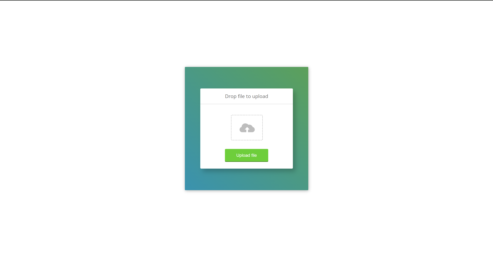

<h1>Upload Challenge</h1>

  
Welcome to the Upload Challenge! This challenge is designed to test and enhance your skills in handling file uploads using HTML, CSS, and JavaScript.

  <h2>Challenge Description</h2>

  
The challenge involves creating a file upload interface where users can drag and drop files or select files using a file input. Upon selecting or dropping a file, the interface should display the filename and simulate an upload process when the user clicks an "Upload" button. The interface should provide visual feedback such as syncing and completion indicators.

  <h2>Purpose</h2>

  
The purpose of this challenge is to practice and demonstrate proficiency in:

  <ul>
    <li>Implementing drag and drop functionality in web applications.</li>
    <li>Handling file selection and display of file information dynamically.</li>
    <li>Simulating an upload process with visual indicators using CSS animations and JavaScript.</li>
  </ul>

  <h2>Features</h2>

  <ul>
    <li>Drag and drop file upload.</li>
    <li>File selection using a file input.</li>
    <li>Displaying the selected file name.</li>
    <li>Simulated upload process with syncing and completion animations.</li>
  </ul>

  <h2>Prerequisites</h2>

  
To participate in this challenge, you should have a basic understanding of:

  <ul>
    <li>HTML5 for markup.</li>
    <li>CSS3 for styling, including animations.</li>
    <li>JavaScript for DOM manipulation and event handling.</li>
  </ul>

  <h2>Challenge Structure</h2>

  
The challenge structure involves:

  <ul>
    <li><strong>HTML:</strong> Structure the file upload interface with necessary elements.</li>
    <li><strong>CSS:</strong> Style the interface to provide a visually appealing and functional design.</li>
    <li><strong>JavaScript:</strong> Implement the logic for handling file uploads, animations, and interactions.</li>
  </ul>

  <h2>Installation</h2>

  
There's no specific installation required for this challenge as it runs directly in the browser. Simply clone or download the repository from the GitHub link provided and open the <code>index.html</code> file in your preferred web browser.

  <h2>Preview</h2>

  
You can view a live demo of the challenge on <a href="https://codepen.io/Yashi-the-lessful/pen/BaeVrYo">CodePen</a>.

  
 Screenshot 

  

  <h2>Contributing</h2>

  
Contributions to improve the code or add new features are welcome! Follow these steps to contribute:

  <ol>
    <li>Fork the repository.</li>
    <li>Create a new branch (<code>git checkout -b feature/your-feature-name</code>).</li>
    <li>Make your changes.</li>
    <li>Test your changes thoroughly.</li>
    <li>Commit your changes (<code>git commit -am 'Add new feature'</code>).</li>
    <li>Push to the branch (<code>git push origin feature/your-feature-name</code>).</li>
    <li>Create a new Pull Request.</li>
  </ol>

  
Please ensure your code follows the existing coding style and practices.

  <h2>Credits</h2>

  
Credits for the design inspiration go to <a href="https://100dayscss.com/days/15/">100 Days CSS Challenge - Day 15</a>.

  <h2>Author</h2>

  
This challenge was created by Yashi Singh.

